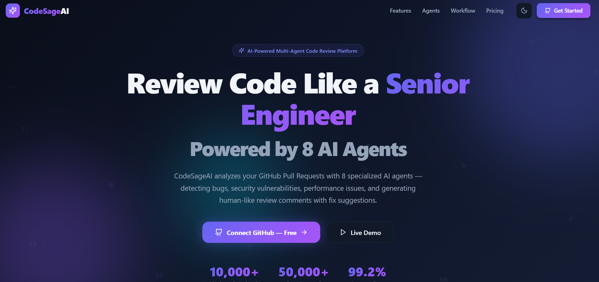

<div align="center">

# 🧠 CodeSageAI

**AI-Powered Code Review & Pull Request Analysis Platform**



[](https://nextjs.org/)
[](https://react.dev/)
[](https://tailwindcss.com/)
[](https://www.typescriptlang.org/)
[](https://opensource.org/licenses/MIT)

*CodeSageAI acts as your senior engineering partner, analyzing GitHub Pull Requests with 3 consolidated AI agents + a Smart Scanner pipeline (Tree-sitter → Semgrep → VulnLLM → Qwen Coder) to detect bugs, security vulnerabilities, and performance issues with real-time progress tracking.*

[Live Demo](#) · [Report Bug](https://github.com/prashant-sagar-shakya/CodeSageAI/issues) · [Request Feature](https://github.com/prashant-sagar-shakya/CodeSageAI/issues)

</div>

---

## 🚀 Overview

**CodeSageAI** is a robust platform designed to elevate code quality through autonomous, AI-driven reviews. Simply connect your GitHub account, select a repository, and let our multi-agent architecture dive deep into your codebase. Powered by Hugging Face's open-source LLMs, it simulates a senior engineer's review process, catching issues that traditional linters miss, and providing actionable, inline fix suggestions — all with live scan progress and ETA tracking.

### 🎯 Target Audience
- **Software Engineers:** Automate code reviews with actionable insights.
- **Open Source Contributors:** Ensure PRs meet high-quality standards before merging.
- **Team Leads:** Monitor project health, technical debt, and team coding practices.
- **Startups:** Ship features faster with AI-assisted code validation.
- **Students & Interview Candidates:** Learn industry best practices and write production-grade code.

---

## ✨ Key Features

- **Consolidated AI Agents:** 3 optimized agents (Code Health, Reliability, Security) for comprehensive, credit-efficient analysis.
- **Smart Scanner Pipeline:** Tree-sitter → Semgrep → VulnLLM-R-7B → Qwen Coder for deep vulnerability and logic review.
- **Real-Time Scan Progress:** Live progress bar with ETA, showing which agent is currently scanning.
- **GitHub App Integration:** Seamlessly fetch branches, PRs, and commits via GitHub App OAuth.
- **GitHub-style Code Diff Viewer:** Review inline AI comments right within the code diff.
- **Premium UI/UX:** Stunning Dark/Light mode interface with glassmorphism, built on Next.js 15 & Tailwind v4.
- **Interactive Dashboards:** Real-time charts, score rings, and repository health radars.
- **Detailed Reporting:** Exportable PDF, Markdown, and HTML reports summarizing security, performance, and maintainability scores.

---

## 🤖 Multi-Agent Architecture

Our platform uses a consolidated, credit-efficient architecture:

### Core AI Agents (LangGraph Pipeline)
1. 📂 **Repository Analyzer:** Understands folder structure, tech stack, dependencies, and core files.
2. 🏥 **Code Health Agent:** Combines code quality, documentation, and refactoring analysis — enforces SOLID principles, naming conventions, missing docs, and clean architecture.
3. ⚙️ **Reliability Agent:** Combines bug detection, performance, and testing — identifies null pointers, memory leaks, N+1 queries, and missing test coverage.
4. 🛡️ **Security Agent:** Conducts OWASP Top 10 checks (SQLi, XSS, CSRF, hardcoded secrets, CWE mapping).

### Smart Scanner Pipeline (AI Fallback)
5. 🌳 **Tree-sitter:** AST parsing for structural code analysis.
6. 🔍 **Semgrep:** Static analysis for pattern-based vulnerability detection.
7. 🧠 **VulnLLM-R-7B:** AI-powered security vulnerability review.
8. 💡 **Qwen Coder:** Logical bug and correctness review.

> The Smart Scanner only activates when the main 3 agents find fewer than 3 issues, saving API credits while ensuring thorough coverage.

---

## 💻 Tech Stack

### Frontend (Phase 1)
- **Framework:** [Next.js 15](https://nextjs.org/) (App Router)
- **UI Library:** [React 19](https://react.dev/)
- **Styling:** [Tailwind CSS v4](https://tailwindcss.com/)
- **Animations:** [Framer Motion](https://www.framer.com/motion/)
- **Charts:** [Recharts](https://recharts.org/)
- **Icons:** [Lucide React](https://lucide.dev/)

### Backend & AI
- **Framework:** Python, FastAPI
- **AI/LLM:** LangGraph, Hugging Face Serverless Inference API (Qwen 2.5 Coder 32B)
- **Smart Scanner:** Tree-sitter, Semgrep, VulnLLM-R-7B, Qwen Coder
- **Database:** PostgreSQL, Redis
- **Infrastructure:** Docker, GitHub Actions

---

## 🛠️ Getting Started

### Prerequisites
- [Node.js](https://nodejs.org/) (v18.17.0 or higher)
- [Python 3.12+](https://www.python.org/)
- [PostgreSQL](https://www.postgresql.org/)
- [Hugging Face Account](https://huggingface.co/) (free tier works!)

### Installation

1. **Clone the repository:**
   ```bash
   git clone https://github.com/prashant-sagar-shakya/CodeSageAI.git
   cd CodeSageAI
   ```

2. **Setup Backend:**
   ```bash
   cd backend
   python -m venv venv
   source venv/bin/activate  # Windows: venv\Scripts\activate
   pip install -r requirements.txt
   ```

3. **Configure Environment:**
   ```bash
   cp .env.example .env
   # Edit .env with your Hugging Face API key and PostgreSQL credentials
   ```

4. **Install Frontend Dependencies:**
   ```bash
   cd ../frontend
   npm install
   ```

5. **Run both servers:**
   ```bash
   # Terminal 1 — Backend
   cd backend && uvicorn app.main:app --reload

   # Terminal 2 — Frontend
   cd frontend && npm run dev
   ```

6. **Open your browser:**
   Navigate to [http://localhost:3000](http://localhost:3000) to see the application running.

---

## 📸 Platform Highlights

*(Add your screenshots here once deployed)*

- **Landing Page:** Animated, premium introduction to the platform.
- **Dashboard:** Interactive health metrics and activity feeds.
- **PR Review View:** Split-diff viewer with multi-agent status panels and issue cards.
- **Reports:** Comprehensive score breakdowns and export options.

---

## 🤝 Contributing

Contributions are always welcome! Whether it's reporting a bug, suggesting a feature, or writing code.

1. Fork the Project
2. Create your Feature Branch (`git checkout -b feature/AmazingFeature`)
3. Commit your Changes (`git commit -m 'Add some AmazingFeature'`)
4. Push to the Branch (`git push origin feature/AmazingFeature`)
5. Open a Pull Request

---

## 📄 License

This project is licensed under the MIT License - see the [LICENSE](LICENSE) file for details.

---

<div align="center">
  <b>Built with ❤️ for developers who care about code quality.</b>
</div>
